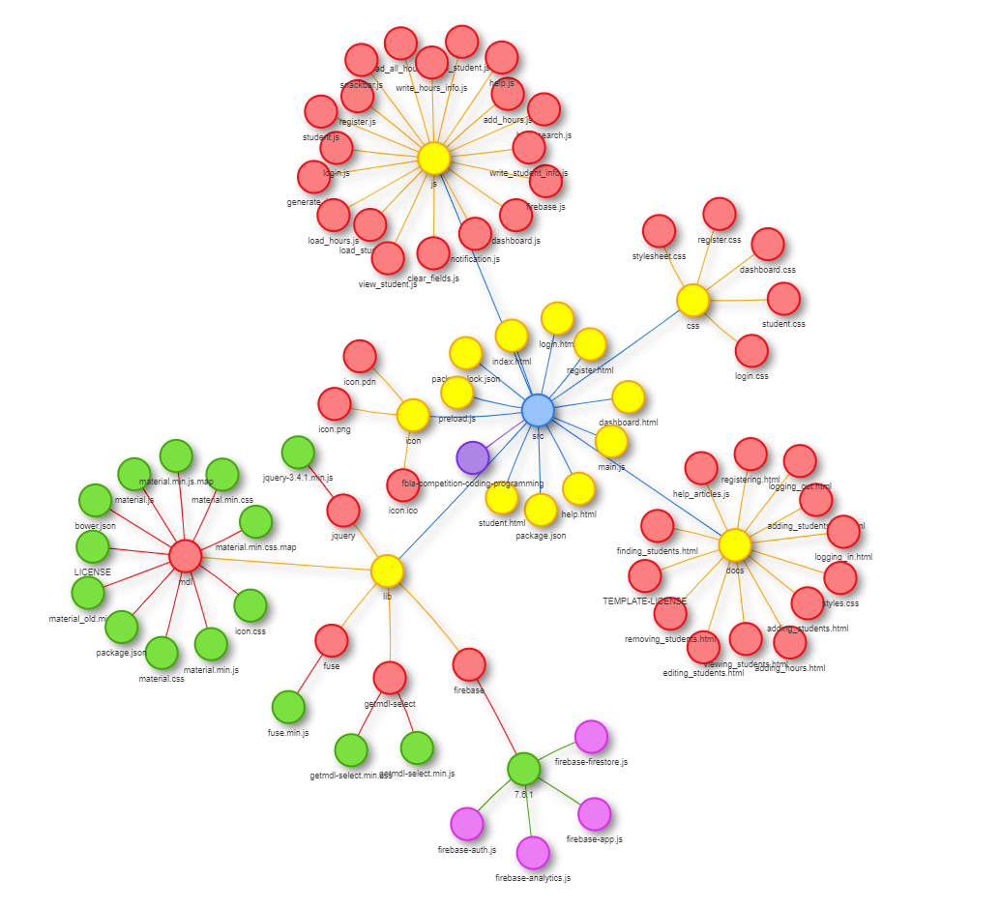
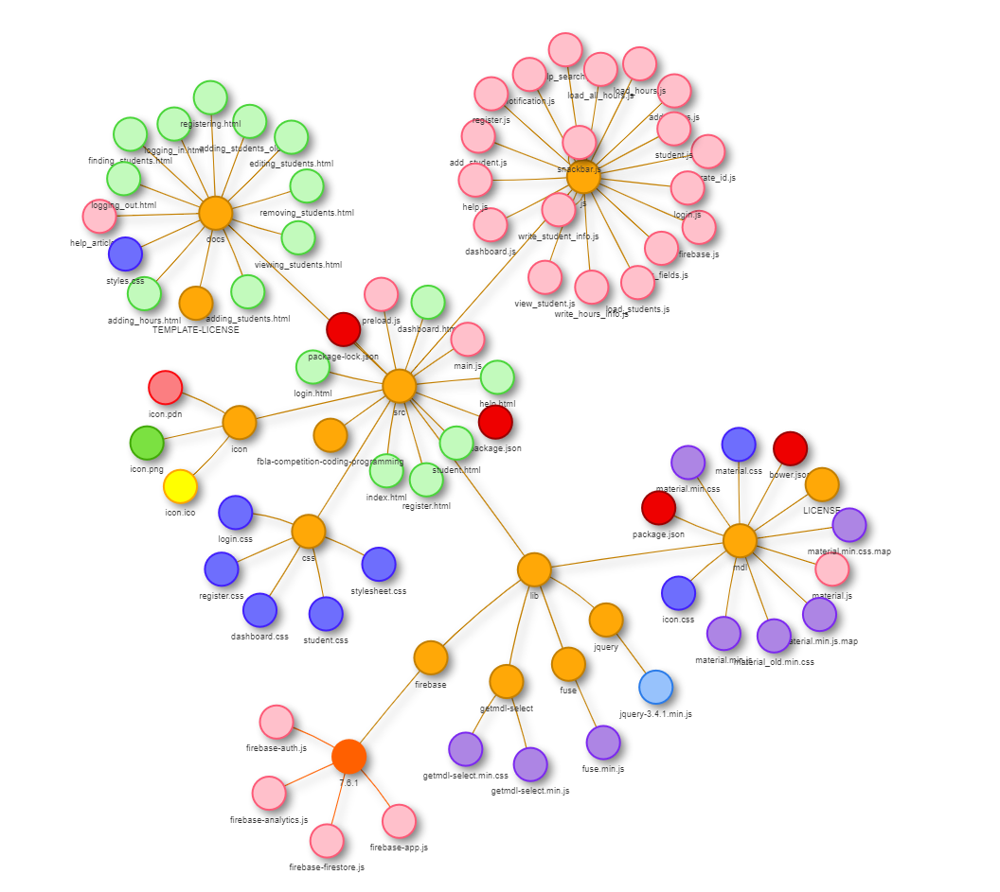

# FBLA CSA Service Tracker

My entry for https://www.fbla-pbl.org/competitive-event/coding-programming/

## Table of Contents

<!-- TOC depthFrom:1 depthTo:6 withLinks:1 updateOnSave:1 orderedList:1 -->

1. [fbla-competition-coding-programming](#fbla-competition-coding-programming)
	1. [Table of Contents](#table-of-contents)
	2. [Installation](#installation)
		1. [As a web app (easiest)](#as-a-web-app-easiest)
		2. [As a desktop app (standalone)](#as-a-desktop-app-standalone)
		3. [Build (advanced)](#build-advanced)
	3. [Usage](#usage)
	4. [Why a web app?](#why-a-web-app)
		1. [Security](#security)
		2. [Portability](#portability)
	5. [Languages](#languages)
		1. [HTML](#html)
		2. [CSS](#css)
		3. [JavaScript](#javascript)
		4. [JSON](#json)
	6. [Files](#files)
		1. [Pages [HTML]](#pages-html)
		2. [Scripts [JavaScript]](#scripts-javascript)
		3. [Other](#other)
	7. [Acknowledgements](#acknowledgements)
		1. [Libraries](#libraries)
			1. [Electron](#electron)
			2. [Electron Packager](#electron-packager)
			3. [Material Design Lite](#material-design-lite)
				1. [getmdl-select](#getmdl-select)
			4. [Firebase](#firebase)
			5. [jQuery](#jquery)
			6. [Fuse.js](#fusejs)
		2. [Snippets](#snippets)
		3. [Other Software Used](#other-software-used)
			1. [Atom](#atom)
				1. [markdown-toc](#markdown-toc)
				2. [line-count](#line-count)
			2. [Google Chrome](#google-chrome)
			3. [Git](#git)
			4. [Paint.NET](#paintnet)
			5. [ICO Convert](#ico-convert)
			6. [rcedit](#rcedit)
	8. [Database](#database)

<!-- /TOC -->

The application is built as a [web app](https://en.wikipedia.org/wiki/Web_application) using HTML, JavaScript, and CSS and can therefore act as a website, runnable through the browser. Since it does not depend on a web server to run, it can be run standalone in the browser by opening `index.html` in web browsing software such as Google Chrome, Firefox, or Safari. ~~Future work could include wrapping the application into an [Electron](https://electronjs.org/) app so it can be used as a native desktop application.~~ I have used [Electron.js](https://electronjs.org/) to convert the web app into a standalone desktop app runnable as an executable file; the app continues to work the same way when run through a web browser.

## Features

 - Add students to database
 - Edit student information easily
 - Track student name, grade, number, and service hours
 - Persistent data storage via Firebase
 - Fully built out authentication system: logging in and out, account creation, etc.
 - Interactive help page search menu
 - Detailed information to track when and by whom students are created
 - Add and edit volunteer events / service hours
 - Automatically update total number of service hours and Community Service Awards category
 - Easily view and interact with database of students
 - Advanced search functionality for both students and service events

## Installation

The program is [standalone](https://en.wikipedia.org/wiki/Standalone_software) and [portable](https://en.wikipedia.org/wiki/Portable_application); it is not installed in a traditional sense in that no files are created or modified outside of the project folder when the program is used and the entire thing is self-contained. The only caveat to this is the external [Firebase](https://firebase.google.com/) database described below. Isolating this database and the authentication system is important for security purposes. It is portable in that the project folder can easily be moved to almost any computer and easily run there.

There are two main options for getting the software ready to use:

### As a web app (easiest)

 1. Download or clone this repository
 2. Open `src/index.html` using Google Chrome (recommended), Firefox, or a similar web browser

### As a desktop app (standalone)

Instructions for Windows:

1. Download or clone this repository
2. Locate the application folder; this folder has an executable version of the program ready to run. Currently it is titled `fbla-app-win32-x64` and can be found in `/src`.
3. Find the executable file in the application folder and run it

Additionally, advanced users may want to use Electron.js to build the standalone version of the app themselves:

### Build (advanced)

1. Download or clone this repository
2. Install [Node.js](https://nodejs.org/en/)
3. Install [NPM](https://www.npmjs.com/) (Node Package Manager)
4. Open a command prompt
5. `CD` to the directory of the repository (/src recommended)
6. Run `npm install` to install dependencies and packages
7. Run `npm start` to prepare the application using Electron.js (see below) and run it in a temporary window
8. Close when finished (alternatively use CTRL+C in the command window to end the process)
7. Run `npm start` to prepare the application using Electron.js (see below) and run it in a temporary window

## Usage

1. Prepare for usage as described above
2. Refer to help pages for information about specific tasks:
	- Adding students
	- Removing students
	- Modifying student information
	- Adding volunteer hours
	- Viewing student volunteer activity
	- Viewing a list of students

## Why a web app?

### Security

### Portability
This program can be run locally as described above, uploaded to a web server and used as a website, ~~or converted to a desktop app with minimal effort using a tool like Electron~~ or run as a desktop app using [Electron.js](https://electronjs.org/). This makes it easy to use regardless of where the user is and eliminates the need for dependencies on other software packages; everything that is needed can be loaded dynamically.

## Languages

This tool is coded as a web application and uses the following programming and markup languages to function.

### HTML
Markup language used to provide the structure of a website or web application; the "skeleton" of the program.

### CSS
Markup language that changes the styling of HTML elements; the "paint" applied to make websites look better.

### JavaScript
Scripting language used for dynamic content and interactive functionality.

### JSON
A data serialization language used in Firebase databases.

## Files

### Map

A web map of the main files in the repository (excluding Git, Node.js-related files, etc.) - created using one of my other tools, [Tree](https://github.com/generic-github-user/Tree).

*Colored based on file level:*



*Colored based on file type*



### Pages [HTML]

 - Home (index.html) - main and default page
 - Login (login.html) - used to log into the application
 - Register (register.html) - account creation page
 - Dashboard (dashboard.html) - main hub for viewing data and performing actions
 - Student (student.html) - view detailed information about a specific student and edit, print, export, or delete student information
 - Help pages (adding_students.html, etc.)

### Other

 - node_modules
 - bin

## Acknowledgements

### Libraries

#### Electron
https://electronjs.org/

Used as a wrapper for the web app to run it as an executable file for Windows, Linux, and MacOS through the Chromium browser (in order to meet the standalone software requirement in the rules).

#### Electron Packager
https://github.com/electron/electron-packager

Used to build and package the web app into an Electron executable runnable on any Windows machine.

#### Material Design Lite
https://getmdl.io/

Responsive web design framework by Google

##### getmdl-select
http://creativeit.github.io/getmdl-select/

Dropdown input for Material Design Lite (not included by default).

#### Firebase
https://firebase.google.com/

Application backend and database tool, also by Google

Provides:
- Database (see below)
- Authentication
- Crash reporting

#### jQuery
https://jquery.com/

Multi-purpose JavaScript library - used for various functions

#### Fuse.js
https://fusejs.io/

JavaScript fuzzy string search library used in the help search and action button. See `src/js/help_search.js`.

### Snippets

Short sections of code and templates used in the project.

 - Email address-matching regular expression: https://stackoverflow.com/a/742455
 - Center login field on page: https://stackoverflow.com/a/47783851
 - Dashboard page layout: https://getmdl.io/components/index.html#layout-section
 - Adding data to Firebase Cloud Firestore: https://github.com/firebase/snippets-web/blob/cec7d56a58076a5fb6a1fb1de2d65f617d617113/firestore/test.firestore.js#L92-L102
 - Snackbar code: https://getmdl.io/components/index.html#snackbar-section
 - Electron starter code: https://github.com/electron/electron-quick-start/blob/master/main.js
 - Other Electron scripts: https://github.com/electron/electron-quick-start
 - Various Firebase / Cloud Firestore: https://github.com/firebase/snippets-web/blob/cec7d56a58076a5fb6a1fb1de2d65f617d617113/firestore/test.firestore.js
 - Firebase storage ID generation: https://gist.github.com/mikelehen/3596a30bd69384624c11
 - Material Design Lite article template (Apache License): https://github.com/google/material-design-lite/tree/mdl-1.x/templates/article

### Other Software Used

Software not included in the program itself, but used to create it.

#### Atom
https://atom.io/

The best text editor ever, with full customization, incredible package manager, autofilling snippets, Git integration, and much more.

##### markdown-toc
https://github.com/nok/markdown-toc

An Atom package (plugin) that allows for easy generation of table of contents.

##### line-count
https://atom.io/packages/line-count

An Atom package for counting lines of code in a given project/repository.

#### Google Chrome
https://www.google.com/chrome/

Web browser used for most testing and foundation for Electron.

#### Git
https://git-scm.com/

Version control & file tracking protocol.

#### Paint.NET
https://www.getpaint.net/

Mid-level image editing software used to create icon.

#### ICO Convert
https://icoconvert.com/

For converting .png files or other image files to .ico files that can be used as the icon for Windows applications.

#### rcedit
https://github.com/electron/rcedit

Used for setting properties of .exe files; icons, descriptions, version, and more.

Example Windows commands for setting executable file properties (assuming `rcedit.exe` has been added to `%PATH%`):

```
rcedit service-tracker.exe --set-file-version "1.0.0"
rcedit service-tracker.exe --set-product-version "1.0.0"
rcedit "service-tracker.exe" --set-icon "./resources/app/icon/icon.ico"
rcedit "service-tracker.exe" --set-version-string "FileDescription" "FBLA CSA Service Tracker"
rcedit "service-tracker.exe" --set-version-string "ProductName" "FBLA CSA Service Tracker"
rcedit "service-tracker.exe" --set-version-string "OriginalFilename" "service-tracker.exe"
rcedit "service-tracker.exe" --set-version-string "Copyright" "Copyright (C) [Name] 2020."
```

## Database

 - Uses Cloud Firestore database included with Firebase by Google: https://firebase.google.com/
 - Could easily be ported to a local JSON file or a different database service
 - Firebase projects can be transferred between users
 - Database Structure
   - `/students` - collection containing a document for each student in the system
     - `/name` - student's name
     - `/grade` - student's grade
     - `/total_hours` - total volunteer hours for a given student
     - `/number` - student number
 - Example (from `src/js/write_student_info.js`):
      ```js
      var student_data = {
            name: name,
            number: number,
            grade: grade,
            total_hours: hours,
            updated: new Date().getTime(),
            updated_by: firebase.auth().currentUser.uid,
            created: new Date().getTime(),
            created_by: firebase.auth().currentUser.uid
      };
      ```
 - Cloud Firestore location: nam5 (us-central)
